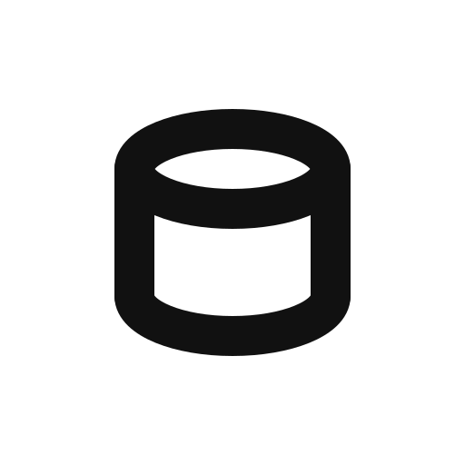

<div align="center">



# dbSDK

**Create, manage, and query databases with one TypeScript SDK.**

Bring your provider credentials: one typed control plane to provision and
manage resources, one typed client to run queries.

</div>

dbSDK has two halves that share one design language.

**Management (the control plane).** Bring your own provider credential and
get one stable verb set over provider resources: `create`, `list`, `get`,
`update`, `delete`, and `wait`. (Credentials shipping today: a Supabase
personal access token, a Neon API key, or a PlanetScale service token —
see [Current coverage](#current-coverage).) Provision a project, wait until
it is ready, retrieve the connection details, and hand them to the query
client. There is no central
dbSDK backend, no credential proxying, and no automatic replay of
create or delete.

**Queries (the typed PostgreSQL client).** Connect to the database you
already have, or the one you just provisioned, and write PostgreSQL.
dbSDK normalizes everything around the query: parameter binding, the
result envelope, errors, transactions, and capability checks.

**Sync (`dbsdk/sync`).** One-way, resumable transfer between two
databases from different providers: a keyset-paginated source, an
idempotent upsert target, and a caller-owned checkpoint store. Initial
copy and incremental rerun are the same primitive. Failures stop with the
original error and the last committed cursor; nothing retries silently.
Explicit identities and verified unique ordering are required, the copied
payload is value-faithful (exact timestamps, JSON arrays and JSON null
survive verbatim, and numeric/decimal arrays are delivered as exact text),
the source's cached schema snapshot is re-validated against the catalog on
every read (schema drift after the first read fails loudly before anything
is written), and the docs are equally explicit about what it is
not: no delete propagation, no CDC, no bidirectional sync.

**Drizzle interop (`dbsdk/drizzle`) and schema authoring (`dbsdk/orm`).** An
optional bridge hands Drizzle ORM's stable node-postgres / neon-http drivers
a validated, dbSDK-owned connection: typed schema queries, joins, and
relational queries run on the same pool dbSDK manages, with lifetime
ownership, verified TLS, and the pooler guards preserved. Typing is
peer-free: the shared entry's declarations never name
`@neondatabase/serverless`, explicit-schema calls
(`drizzleNeonHttp<MySchema>(db)`) keep the full official `$client` surface
via a structural mirror, and the `dbsdk/drizzle/neon-http` type entry (same
runtime module) serves code that names the driver's nominal
`NeonHttpDatabase`/`NeonQueryFunction` classes. `dbsdk/orm` is a
pure re-export of the same stable drizzle-orm (0.45.x) root + pg-core
authoring surface as a single import, so schemas authored through it are the
same objects the bridge executes — PostgreSQL authoring only. On the bridge's
supported execution paths, failures surface as dbSDK's normalized `DbError`
(`code`, `sqlstate`, `indeterminate` per the indeterminate-write policy) with
the native driver error preserved on `cause` — Drizzle's raw query wrapper
(which echoes SQL parameters) is unwrapped, and dbSDK never retries or replays
a write. Three boundaries stay raw by design: the `$client` / `db.raw` escape
hatches, Drizzle's deliberate-abort signal (`tx.rollback()`), and misuse that
throws while *constructing* a query object (before Drizzle is called, e.g.
`.values([])`). Drizzle is used unmodified from its published package — the
bridge extends the stable drivers' own session seam, it does not fork them —
and Studio, Kit, seed, and migrations are separate upstream tools, not
claimed here.

- **Parameterized by construction.** Interpolated values become positional
  bind parameters. They can never become identifiers or raw SQL fragments.
- **One result shape.** Every query adapter returns `{ rows, rowCount, command? }`,
  on TCP, HTTP, and WebSocket transports alike.
- **Honest capabilities.** Each adapter declares what it supports, on both
  planes. Unsupported operations fail before dispatch. Nothing falls back
  silently.
- **Writes are never replayed.** If a connection drops after a write was
  sent, the error is marked `indeterminate`. You decide what to do. The
  same rule governs management mutations.
- **Secrets stay secrets.** Credentials are options you pass in; secrets
  the provider returns surface only in explicit `secrets` fields and are
  redacted from every raw payload and error message.

## Current coverage

dbSDK's design is provider-agnostic: the provider enters as a credential you
own, and the adapter interface, capability model, and error contract do not
change when a provider is added. The adapters and management integrations
shipping today cover the PostgreSQL ecosystem:

- **PostgreSQL** — any PostgreSQL endpoint you can reach (plain `postgres`
  adapter).
- **Supabase** — management via personal access token; direct / session /
  transaction connection modes.
- **Neon** — management via API key; HTTP, websocket, and
  websocket-transaction query transports.
- **PlanetScale Postgres** — management via service token; direct and pooled
  connection modes.

More major providers are planned. Provider-specific credentials, connection
modes, transport limitations, and refusal behaviors are documented per
adapter and kept precise — they are technical facts about how each provider
works, not positioning.

## Status

Version 0.1, source-only. **There is no npm package yet**, so nothing here
will ask you to `npm install dbsdk`. You install from this repository
(instructions below). The current verification is local and offline: the
automated suite passes with no hosted calls; live checks that need
credentials skip automatically, and the ones that can run use a real
postgres 17 container locally, the Neon HTTP protocol through a local
proxy, and the Supabase and PlanetScale adapters against a local server. No
hosted Supabase, Neon, or PlanetScale endpoint has been touched by this
project, and the docs never claim otherwise.

## Install from source

```bash
git clone https://github.com/pkyanam/dbSDK.git
cd dbSDK
pnpm install
pnpm --filter dbsdk build          # emits packages/dbsdk/dist
```

Then either link the built package into your app:

```bash
# from your app
npm install /absolute/path/to/dbSDK/packages/dbsdk
```

or pack and install the tarball:

```bash
cd packages/dbsdk && npm pack      # produces dbsdk-0.1.0.tgz
npm install ./dbsdk-0.1.0.tgz      # from your app
```

The three database drivers and Drizzle are optional peers, installed only
where you use them: `pg` for the PostgreSQL, Supabase, and PlanetScale
adapters, `@neondatabase/serverless` for the Neon adapter, and
`drizzle-orm` for the Drizzle bridge. The management subpaths need no
driver.

## Quickstart: provision, wait, connect, query

The full path on Neon with a real API key (this provisions a real project
on your account):

```ts
import { createDatabase } from "dbsdk";
import { createManagement } from "dbsdk/management";
import { neon } from "dbsdk/neon";
import { neonManagement } from "dbsdk/management/neon";

const management = createManagement({
  adapter: neonManagement({ apiKey: process.env.NEON_API_KEY! }),
});

const result = await management.create({ kind: "project", name: "my-app" });
const project = await management.wait(result, { timeoutMs: 120_000 });

// Neon returns connection URIs and role passwords once, via secrets.
const connectionString =
  result.secrets.find((s) => s.label === "connectionString")!.value;

const db = createDatabase({
  adapter: neon({ connectionString, transport: "http" }),
});
const { rows } = await db.sql`select version()`;
await db.close();
```

On Supabase, the same flow uses a personal access token; the database
password is generated for you when omitted and returned once through
`secrets`, and the database host comes from the provider:

```ts
import { createDatabase } from "dbsdk";
import { createManagement } from "dbsdk/management";
import { postgres } from "dbsdk/postgres";
import { supabaseManagement } from "dbsdk/management/supabase";

const management = createManagement({
  adapter: supabaseManagement({
    accessToken: process.env.SUPABASE_ACCESS_TOKEN!, // sbp_...
  }),
});

const result = await management.create({
  kind: "project",
  name: "my-app",
  organizationId: process.env.SUPABASE_ORG_ID!,
});
const password = result.secrets.find((s) => s.label === "password")!.value;
const project = await management.wait(result, { timeoutMs: 300_000 });
const host = await management.raw.databaseHost(project.id);

// Assemble Supabase's documented direct connection string from the two
// official pieces; the token is never a database credential.
const db = createDatabase({
  adapter: postgres({
    connectionString: `postgresql://postgres:${password}@${host}:5432/postgres`,
  }),
});
```

A management credential never substitutes for a SQL connection string and
vice versa; see the [credentials guide](https://dbsdk.com/docs/credentials)
for the exact split.

## Quickstart: query a database you already have

```ts
import { createDatabase } from "dbsdk";
import { neon } from "dbsdk/neon";

const db = createDatabase({
  adapter: neon({
    connectionString: process.env.DATABASE_URL!,
    transport: "http", // default; "websocket" enables interactive transactions
  }),
});

const { rows, rowCount, command } = await db.sql`
  select id, email from users where id = ${userId}
`;

await db.close(); // Node 24+: or `await using db = ...` for scoped disposal
```

The same statement, on Supabase, is a connection-mode change rather than a
rewrite:

```ts
import { createDatabase } from "dbsdk";
import { supabase } from "dbsdk/supabase";

const db = createDatabase({
  adapter: supabase({
    connectionString: process.env.SUPABASE_DB_URL!,
    connectionMode: "transaction", // direct | session | transaction
    // Remote Supabase endpoints verify TLS certificates by default and need
    // Supabase's root CA: pool: { ssl: { ca: supabaseCaCert } }. Or opt out
    // explicitly with ssl: { rejectUnauthorized: false }.
  }),
});
```

And on any plain PostgreSQL endpoint:

```ts
import { postgres } from "dbsdk/postgres";

const db = createDatabase({
  adapter: postgres({ connectionString: process.env.PGURL! }),
});
```

And on PlanetScale Postgres (verified TLS by default; `connectionMode` must
match the port — direct 5432, PgBouncer pooled 6432):

```ts
import { planetscale } from "dbsdk/planetscale";

const db = createDatabase({
  adapter: planetscale({
    connectionString: process.env.PLANETSCALE_DB_URL!, // from a role's connection info
    connectionMode: "direct",
  }),
});
```

Dynamic identifiers are explicit and validated; user input never becomes SQL
text:

```ts
import { sql } from "dbsdk";

await db.query(sql`select * from ${sql.identifier(tableName)} limit 10`);
```

## What the query transports support

| Connection mode | Transport | Parameterized query | Interactive transaction | Atomic batch | Session state |
| --- | --- | --- | --- | --- | --- |
| postgres (TCP) | tcp | yes | yes | yes | on a leased session |
| supabase direct | tcp | yes | yes | yes | on a leased session |
| supabase session | tcp | yes | yes | yes | on a leased session |
| supabase transaction | tcp | yes | yes | yes | guarded before dispatch |
| planetscale direct | tcp | yes | yes | yes | on a leased session |
| planetscale pooled | tcp | yes | yes | yes | guarded before dispatch |
| neon http | http | yes | refused before dispatch | yes, one round trip | no |
| neon websocket | websocket | yes | yes | yes | no on pooled hosts |
| neon http + websocket transactions | http + websocket | yes | yes | yes | no on pooled hosts |

"Session state" means `SET`, temp objects, and `LISTEN` persisting on one
dedicated session (inside `transaction()`, which leases a single connection,
or a client leased via `raw`). It does not mean these persist between
separate top-level queries on a pool. Unsupported operations fail before any
network traffic, and no failed write is ever replayed automatically: an
outcome that cannot be known is reported as `indeterminate`. Full table with
evidence levels: [capabilities docs](https://dbsdk.com/docs/capabilities).

## What dbSDK will not do

- No silent failover between providers. Switching adapters moves nothing.
- No automatic retry or replay of writes or management mutations, ever.
  `indeterminate` is reported; the decision is yours.
- No endpoint guessing. Supabase connection modes are explicit and validated
  against the connection string.
- No SQL translation. The query is yours; the plumbing is ours.
- No credential interchange. A PAT or API key never becomes a database
  password; the SDK never fabricates a connection string from a token.
- No central backend. Your credentials go from your process straight to the
  provider.
- No browser sessions. This is a server-side client.

## Documentation

- Getting started: https://dbsdk.com/docs/getting-started
- Management (provisioning and lifecycle): https://dbsdk.com/docs/management
- Provider adapters: postgres, Supabase, Neon, and
  [PlanetScale Postgres](https://dbsdk.com/docs/adapters/planetscale)
- Drizzle ORM interop: https://dbsdk.com/docs/drizzle
- Sync (resumable provider-to-provider transfer): https://dbsdk.com/docs/sync
- Credentials guide: https://dbsdk.com/docs/credentials
- Capabilities: https://dbsdk.com/docs/capabilities
- Also mirrored at https://database-sdk.dev
- Every page is available as Markdown to agents and readers (append `.md`),
  plus `llms.txt`, `llms-full.txt`, and an MCP endpoint on the live site.
- A coding-agent skill lives at [`skills/dbsdk/SKILL.md`](skills/dbsdk/SKILL.md).
- Runnable examples live in [`examples/`](examples/), including management
  flows that need no provider account (the fixture adapters), an
  offline-capable resumable transfer, and a Drizzle interop example.

## Repository layout

```
packages/dbsdk/     the package: core clients, SQL builder, errors, query and management adapters, tests
apps/web/           the documentation site (dbsdk.com), with brand assets in apps/web/public/brand
examples/           runnable TypeScript examples (query, management, sync)
skills/             coding-agent skill
research/           pre-implementation research notes
```

## Contributing

See [CONTRIBUTING.md](CONTRIBUTING.md). Security reports:
[SECURITY.md](SECURITY.md). Changelog: [CHANGELOG.md](CHANGELOG.md).

## Supporting dbSDK

dbSDK is open source and free. If it saves you time, you can sponsor the
project on [GitHub Sponsors](https://github.com/sponsors/pkyanam).

## License

dbSDK is [Apache-2.0](LICENSE) (attribution notices in [NOTICE](NOTICE);
third-party component notices in [THIRD_PARTY_NOTICES.md](THIRD_PARTY_NOTICES.md)).
Historical releases published before the Apache-2.0 adoption remain available
under the MIT license of their own versions.
